```{r setup, include=FALSE}
# echo=FALSE not to display R chunk in slides. Set to TRUE if necessary.
knitr::opts_chunk$set(echo = FALSE)
# tidy R chunks.
knitr::opts_chunk$set(tidy=TRUE, tidy.opts=list(blank=FALSE, width.cutoff=50))
# R console width
options(width=50)
# Install necessary packages only
InstallPackages <- function(Packages) {
  sapply(Packages, function(Package) 
    if (!Package %in% installed.packages()[, 1]) install.packages(Package, repos="https://cran.rstudio.com/"))
}
InstallPackages(c("tidyverse"))
# Tidiverse default options
library("tidyverse")
# Set ggplotting to bw plot default, but with transparent background elements.  
theme_set(theme_bw(base_size=12))
theme_update(panel.background = element_rect(fill = "transparent", colour = NA),
             plot.background = element_rect(fill = "transparent", colour = NA))
knitr::opts_chunk$set(dev.args=list(bg="transparent"))
# Tibbles: 5 lines, fit to slide width
options(tibble.print_min = 5, tibble.width = 50)
```

<!-- Commande de saut de colonne HTML --> 
<style>
  .forceBreak { -webkit-column-break-after: always; break-after: column; }
</style>

<!-- Début du document ci-dessous --> 

# L'histoire

## Contexte{.columns-2}

Laboratoire de recherche. 

Equipes de chercheurs - étudiants - techniciens.

Production de données, méthodes et documents.

<p class="forceBreak"></p>

```{r, echo=FALSE, out.width='100%'}

```


## Organisation spontanée

On pilote difficilement une équipe de chercheurs.

Haut niveau technique.

Tendance à diverger.


## Objectifs

Etre plus efficace.

Echanger plus facilement.

Recherche reproductible.


## Méthode

Les outils ne font pas l'organisation.

Les objectifs sans outils non plus.

Itérations besoins $\leftrightarrow$ outils


# Organiser les données

## Données précieuses

Relativement peu de données en écologie.

```{r, echo=FALSE, out.width='65%'}
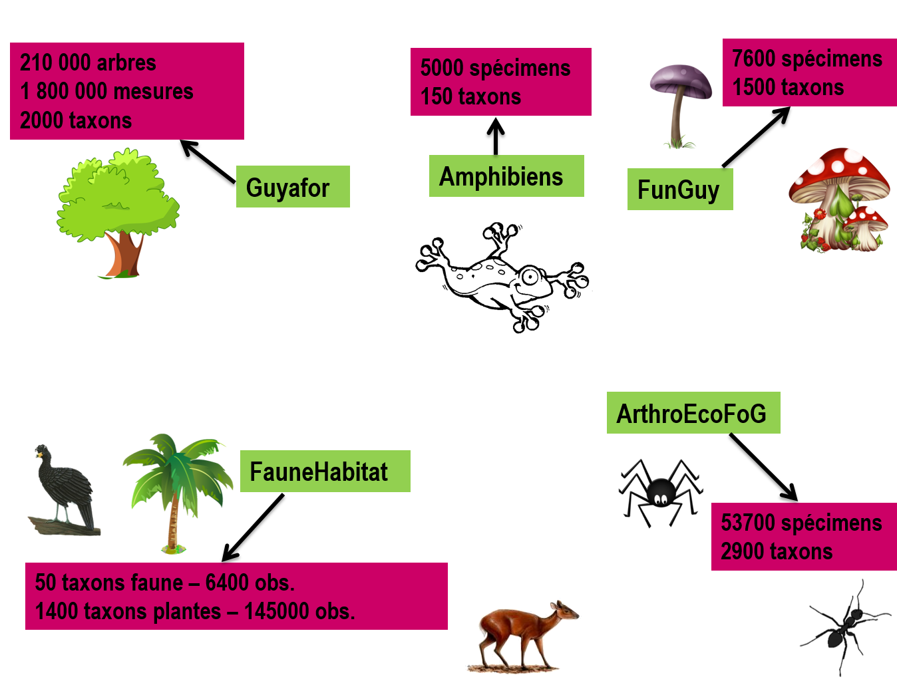
```

Prix unitaire élevé.


## Choix

Données standardisées : SGBDR

Données ponctuelles : 

- tableaux, format CSV

- Accessibles en ligne (partages de fichiers, HTTP).

Une ingénieure de recherche dédiée dans l'unité.


# Analyser les données 

## R

Script pour :

- la reproductibilité

- la versatilité

- l'explicitation

Communauté, gratuité...


## Documentation

Code R avec commentaires

```{r echo=TRUE}
# Addition
2+2
```

Document RMarkdown avec chunks

```{r, echo=FALSE, out.width='60%'}
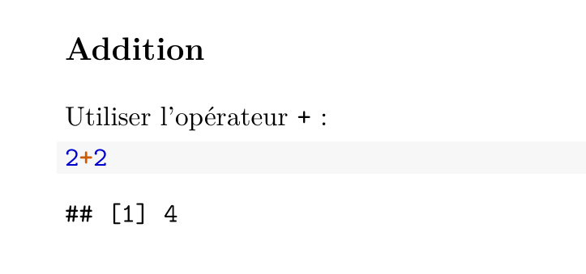
```


# Ecrire

## Enjeux 

Beaucoup de temps passé à produire des documents.

Processus collaboratif nécessaire.

Réutilisation.

## Au début{.columns-2 .smaller}

Documents Word:

- Structuration possible, mais rare,

- Limites dans le rendu final.

\begincols
  \begincol{.48\textwidth}

```{r, echo=FALSE, out.width='90%'}
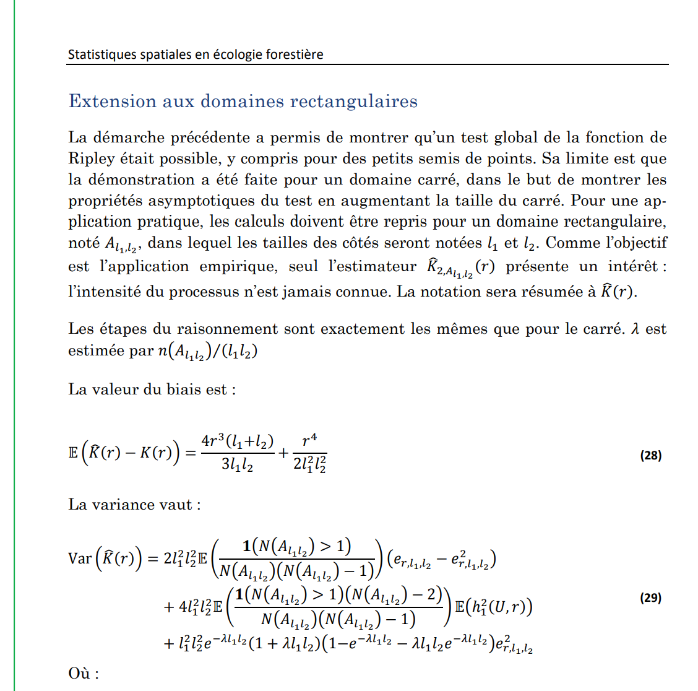
```

  \endcol
  \begincol{.48\textwidth}

```{r, echo=FALSE, out.width='90%'}
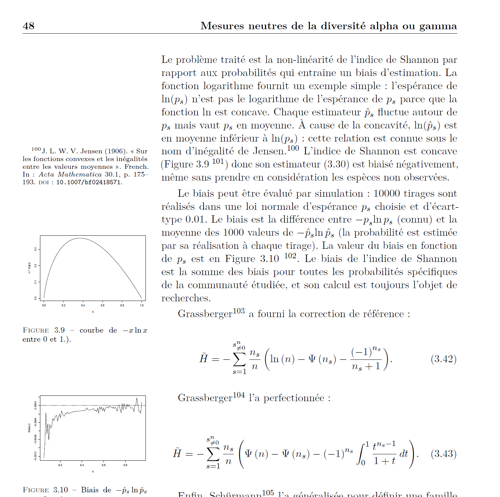
```

 \endcol
\endcols


Echange par messagerie.


## Besoin individuel

Se concentrer sur le fond :

- LaTeX plutôt que Word,

- Markdown plutôt que LaTeX.

Construire sa pensée $\leftrightarrow$ rédiger :

- Intégrer les traitements au texte

- knitR et LaTeX puis RMarkdown.


## Besoin collectif

Ecriture en parallèle

Suivi des versions

## Progrès possibles

Google Docs : collaboration.

SharePoint puis Office 365.

Overleaf:

```{r, echo=FALSE, out.width='70%'}
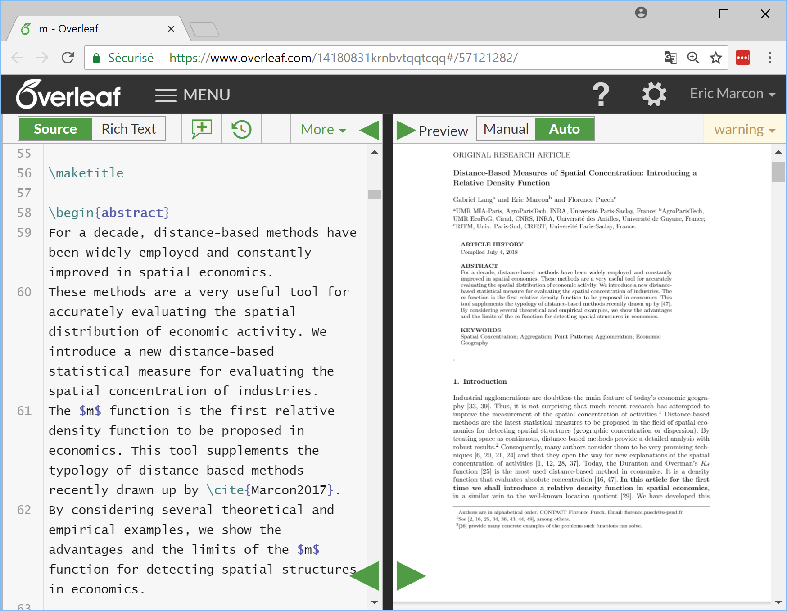
```


## Outils retenus

Environnement de travail unique : RStudio.

Markdown.

Git et GitHub.

Tout document est un projet R.

Tout groupe de méthodes diffusable est un package (GitHub + Travis + CodeCov).


# Organisation

## Un dépôt commun

Sur GitHub: EcoFoG.

```{r, echo=FALSE, out.width='80%'}
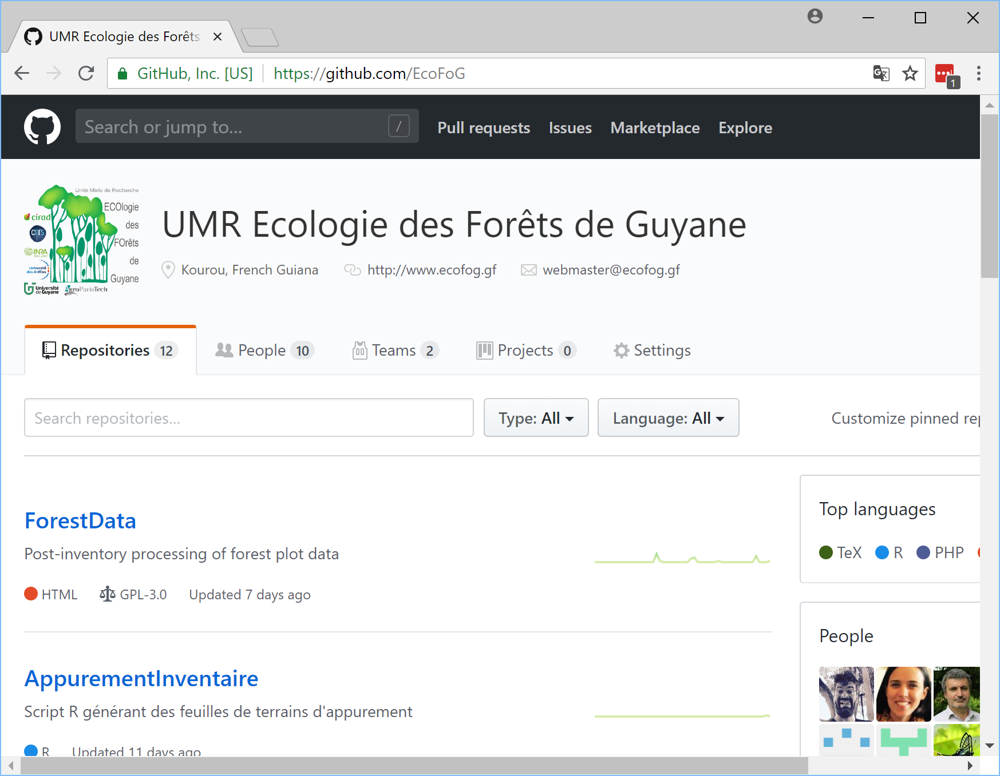
```


## Un package commun

Package EcoFoG.

```{r, echo=FALSE, out.width='80%'}
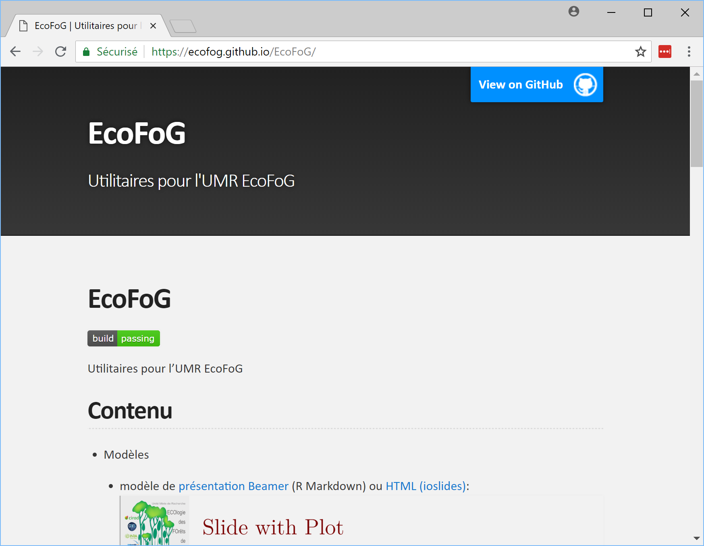
```


## Des modèles de documents{.columns-2}

Présentation.


\begincols
  \begincol{.48\textwidth}

Article

```{r, echo=FALSE, out.width='90%'}
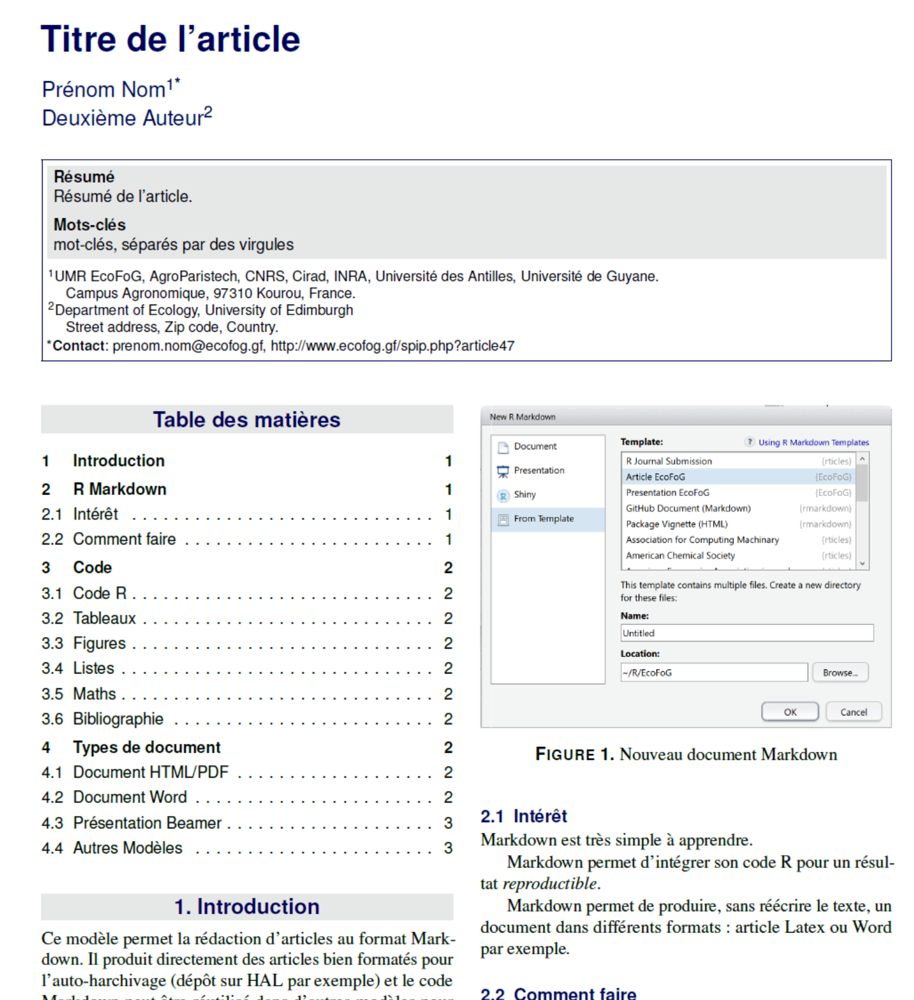
```

  \endcol
  \begincol{.48\textwidth}

Ouvrage

```{r, echo=FALSE, out.width='90%'}
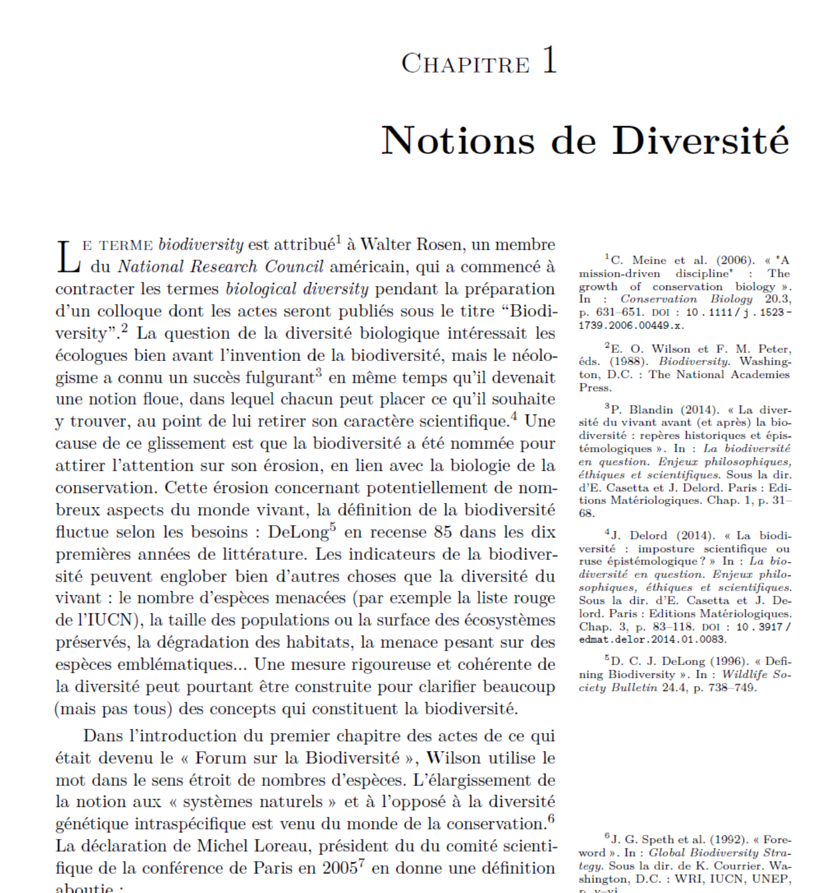
```

 \endcol
\endcols


## Des outils communs

Sans vocation à être publiés sur CRAN

```{r, echo=FALSE, out.width='90%'}
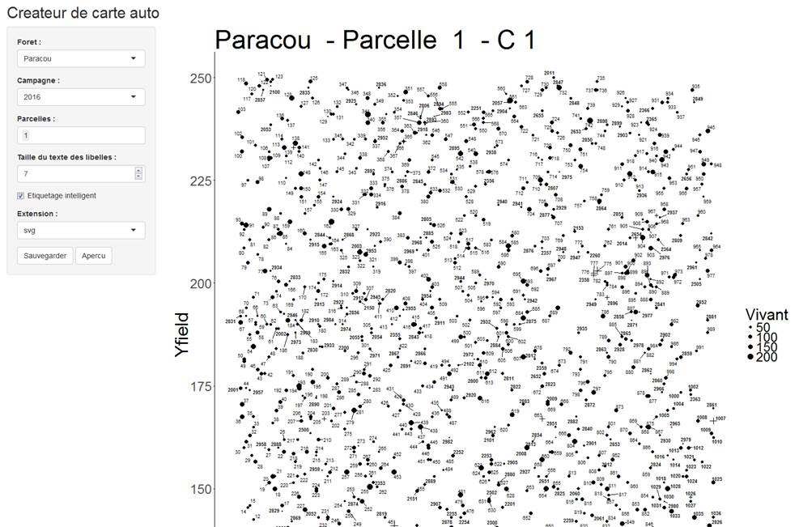
```


## Packages communs / Packages personnels

Dans le dépôt EcoFoG : industrialisation des méthodes.

Dans les dépôts des chercheurs : recherche propre.

Le tout publié sur CRAN.


## Documents communs / Documents personnels

Même fonctionnement.

Utilisation systématique des pages GitHub.

Documents pas forcément publics : dépôt BitBucket.

## Serveur RStudio

Pour les calculs longs ou parallélisés.

```{r, echo=FALSE, out.width='80%'}
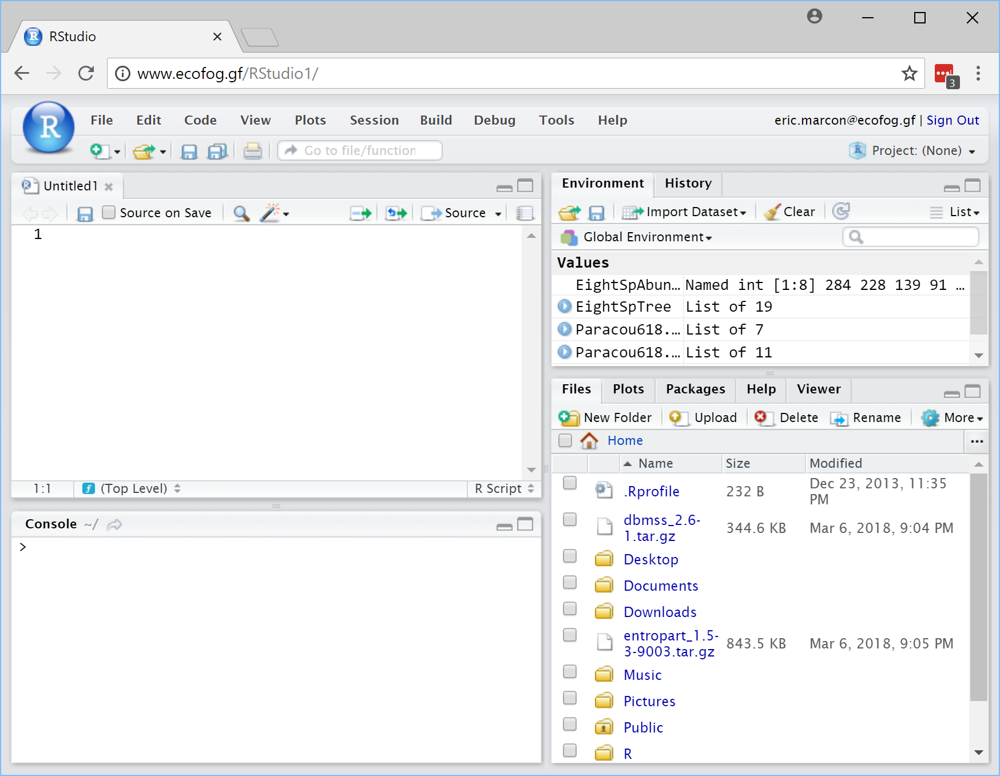
```

Applications Shiny.


## Utilisation systématique

Formation des étudiants.

Cours en ligne.

Support des nouveaux projets.


# Limites

## Envie

Adhésion ou pas.

Arguments : 

- perte de contrôle,

- rigidité,

- pas Wywiwyg.


## Compétences

Formations nécessaires :

- à R,

- à Git,

- à MarkDown... à LaTeX.

## Technique

Manques :

- Correcteur d'orthographe en temps réel


Chaine complexe $\leftrightarrow$ fragile.

Exemples :

- `undefined control sequence \@@magyar@captionfix`;

- R et RTools 3.5.0 et devtools.


# Avantages

## Recherche reproductible

Intégration complète de toute la chaîne.

Données $\rightarrow$ Traitements $\rightarrow$ Figures $\rightarrow$ Texte.

## Multiples formats de sortie

Systématiquement HTML et PDF $\rightarrow$ Pages GitHub.

```{r, echo=FALSE, out.width='70%'}
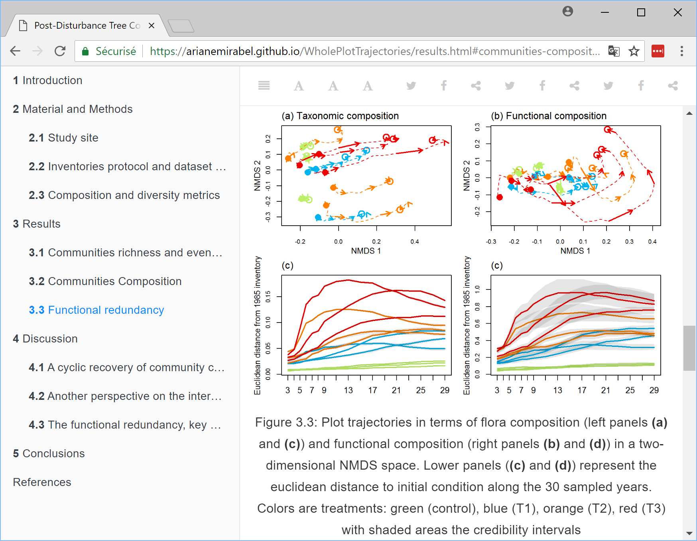
```

Reformatage facile, même vers Word.


## Qualité des documents{.columns-2}

\begincols
  \begincol{.48\textwidth}

Seulement possible avec LaTeX:

- Respect des règles typographiques ;

- Usage des marges.

Mais tout LaTeX n'est pas disponible avec RMarkdown.

  \endcol
  \begincol{.48\textwidth}
  <p class="forceBreak"></p>

```{r, echo=FALSE, out.width='90%'}
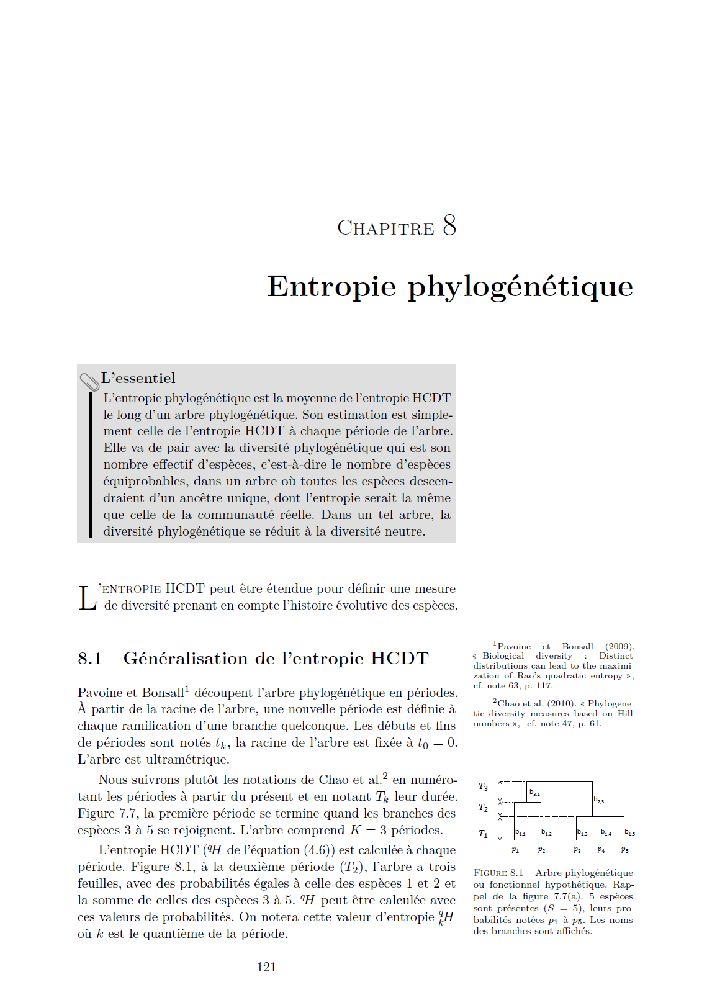
```

 \endcol
\endcols


## Rigueur

Documentation au même niveau que la réflexion.

Possibilité de revenir en arrière, historique.

Réduction des zones d'ombre.

Capitalisation.


## Références

GitHub:

- https://github.com/EcoFoG/

UMR EcoFoG :

- https://www.ecofog.gf/
